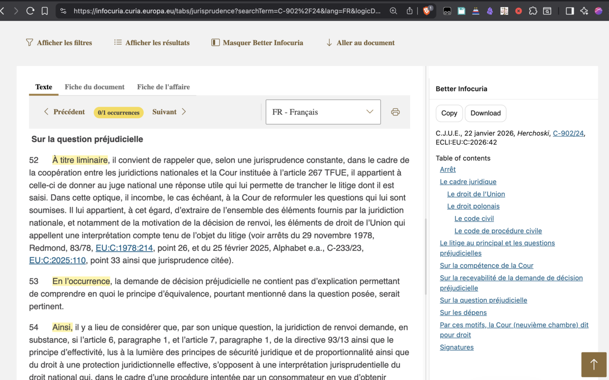

# Better Infocuria

Better Infocuria is a browser extension that improves how you read and cite Court of Justice of the European Union judgments on Infocuria.

GitHub: https://github.com/rafjaf/Infocuria
Chrome Web Store: https://chromewebstore.google.com/detail/better-infocuria/kemkbakjbjfcmaibmbjfkeconcnnnopn
Firefox Add-ons : <TO BE COMPLETED>

## What it does

- Adds a citation panel with ready-to-copy references, including the paragraph number from which the text was copied.
- Builds a document table of contents for fast navigation within a judgment.
- Highlights structure markers in the the text.
- Provides cleaner PDF downloads with friendly filenames.
- Shows a quick info popup when you click the extension icon.
- Displays a brief update banner after new versions are installed.

## Where it runs

- https://infocuria.curia.europa.eu/*

## Limitation

- Currently it only works on the French version of Infocuria.

## Permissions

- downloads: save PDF files with a readable filename.
- clipboardWrite: copy rich citations to the clipboard.
- storage: remember whether the update banner has been shown.

## Install

1. Open the Chrome Web Store listing: <ADD_CHROME_WEB_STORE_URL_HERE>
2. Click “Add to Chrome”.

## Development

1. Clone this repo.
2. In Chrome, open chrome://extensions and enable Developer mode.
3. Click “Load unpacked” and select this folder.

## Data protection

No personal data whatsoever is treated by this extension.

## Feedback

Issues and pull requests are welcome at https://github.com/rafjaf/Infocuria.

## Release history

- 0.1.0 : first version
- 0.1.1 : fixed paragraphs numbering issue